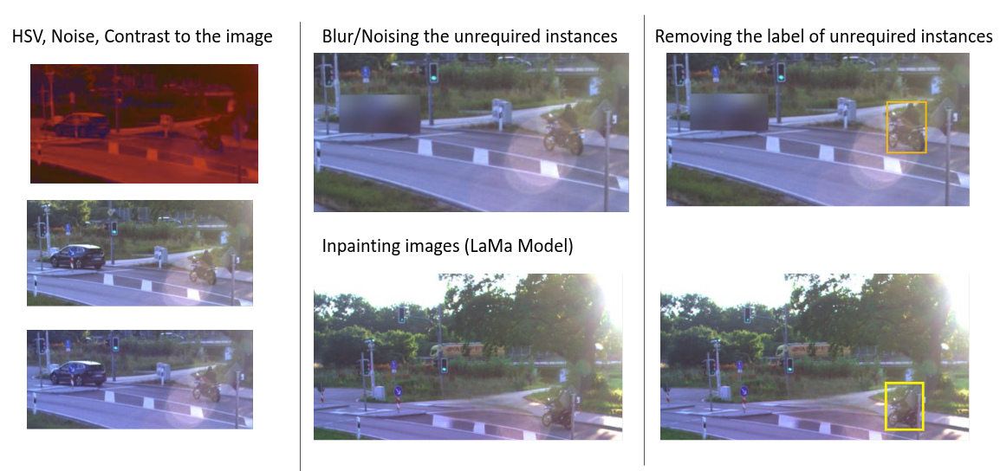

This was a team project done under supervision of [Technische Hochschule University, Ingolstadt](https://www.thi.de/). The goal was to create a perform late-fusion on radar & camerea detections.

This was really fun to work on - got to learn about nitty-gritties of model training, evaluation and spatial fusion of detections. I would like to highlight a few sections here from the project. 

[Github Repo](https://github.com/nairjayesh/Sensor-Data-Fusion)

### Image Augmentation:
Primary problem when it comes to working on road user data is high levels of data imbalance among different classes, we were working with 6  road user classes with the following distribution.

Tried a bunch of different techniques for image augmentation, one of the most interesting was [Image Inpainting](https://github.com/advimman/lama).

